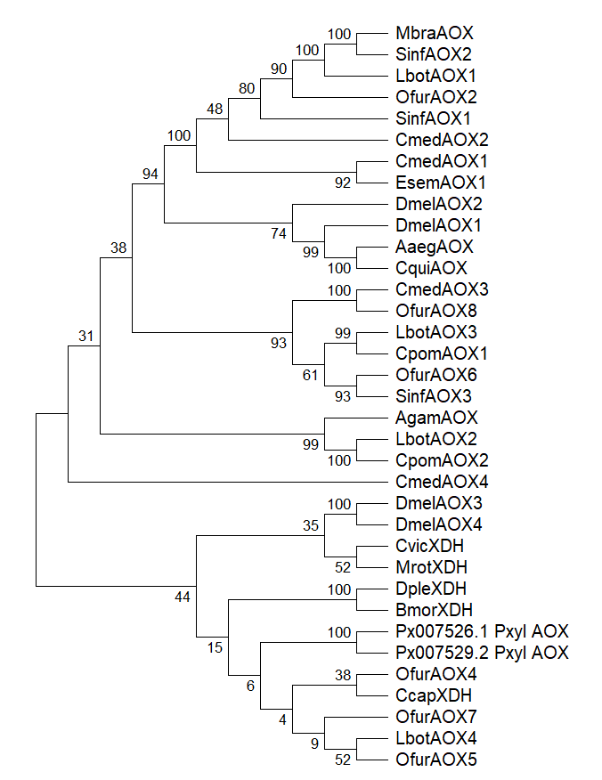

# taller1_bioinfogit

**Asignatura:** Bioinformática  
**Estudiante:** Javier Soler  
**Repositorio:** [taller1_bioinfo](https://github.com/Javier-Soler-bruh/taller1_bioinfo)

---

## Pregunta 1: Regiones conservadas en *LbotAOX1*, *EsemAOX1*, *CmedAOX1* y *SinfAOX1*

A partir del alineamiento múltiple de secuencias (MSA) generado para el subconjunto de datos, se identifican 20 bloques o regiones conservadas que contienen tramos continuos de más de 3 aminoácidos idénticos compartidos entre las cuatro secuencias (LbotAOX1, EsemAOX1, CmedAOX1 y SinfAOX1).

**Metodología aplicada:**
1. Se aislaron las filas correspondientes a las cuatro secuencias solicitadas a partir del archivo FASTA alineado.
2. Se realizó la inspección de la matriz de alineamiento para identificar las columnas con identidad total entre los taxones.
3. Se contabilizaron los bloques continuos donde la coincidencia de aminoácidos idénticos superaba las 3 posiciones consecutivas a lo largo de la longitud de las secuencias.

### 2. Metodología
1. Se reunieron las secuencias aminoacídicas en formato FASTA.
2. Se realizó un alineamiento múltiple con el algoritmo ClustalW en MEGA.
3. Se extrajeron las posiciones correspondientes a las cuatro secuencias especificadas para realizar la inspección visual y la búsqueda de bloques con 100% de identidad.

---

## Pregunta 2

Para  la  reconstrucción filogenética de las aldehído oxidasas (AOX), se realizó un control de calidad y depuración sobre el conjunto de secuencias inicial:

1. **Selección del Frame de Traducción:**
   * Las secuencias nucleotídicas primarias de *Plutella xylostella* (Pxyl, ensamblajes Px007526.1 y Px007529.2) fueron traducidas en sus 6 marcos de lectura posibles.
   * Los marcos 2 al 6 mostraron abundantes codones de parada prematuros (*), produciendo ruido filogenético y errores de cálculo de matriz de distancia.
   * Se seleccionó y conservó únicamente la traducción del Frame 1 (Px007526.1_Pxyl_AOX y Px007529.2_Pxyl_AOX), la cual representa la única pauta de lectura abierta (ORF) continua y funcional con dominios de molibdo-flavoenzimas.

2. **Resolución de Inconsistencias:**
   * Al eliminar los marcos aberrantes, se estabilizó la matriz de distancias en ClustalW/MEGA, eliminando gapping excesivo y logrando un clado monolítico con 100% de soporte bootstrap para las isoformas de Pxyl.

---

## Pregunta 3: Reconstrucción Filogenética y Análisis de Clados

### 1. Metodología Filogenética
* **Algoritmo:** Neighbor-Joining (NJ).
* **Test de Filogenia:** Bootstrap con 1000 réplicas.
* **Tratamiento de Gaps:** Pairwise Deletion.
* **Outgroup:** Secuencias de Xantino Deshidrogenasa (CvicXDH, MrotXDH, DpleXDH, BmorXDH, CcapXDH).

### 2. Árbol Filogenético Generado

## Herramientas Bioinformáticas Utilizadas y sus Aplicaciones

Para el desarrollo, análisis y documentación de este taller, se emplearon las siguientes herramientas:

*   **MEGA (Molecular Evolutionary Genetics Analysis):** Utilizada para realizar el alineamiento múltiple de secuencias (MSA) mediante el algoritmo **ClustalW**, la visualización y curación de las matrices de secuencias de aminoácidos, y la reconstrucción filogenética (aplicando el método *Neighbor-Joining*, 1000 réplicas de *bootstrap* y eliminación por pares).
*   **Archivos en Formato FASTA (.fasta):** Estándar bioinformático empleado para el almacenamiento, manipulación y filtrado de las secuencias crudas y curadas de las proteínas de estudio (*LbotAOX1*, *EsemAOX1*, *CmedAOX1*, *SinfAOX1*, *Pxyl*, entre otras).
*   **Visual Studio Code (VS Code):** Entorno de desarrollo utilizado para la gestión local de archivos, la revisión de secuencias y la redacción de la documentación técnica estructurada en formato Markdown.
*   **Git y GitHub:** Sistema de control de versiones y plataforma de repositorio remoto empleados para el versionado, respaldo y entrega final de los resultados, scripts, imágenes y archivos de texto del taller.
